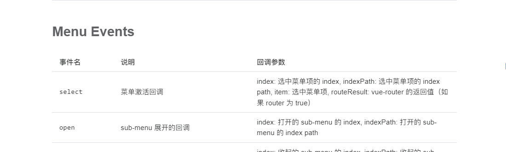

# 动态加载的菜单数据，如何不触发select Menu Events获取indexPath

## 背景

业务开发中，需要实现一个右键在新页面打开当前所选菜单功能，并且新页面打开后，需要高亮选中之前右键点击的那个菜单。因为菜单可配置，数量无法预估，因此菜单的加载被设计成动态加载，触发条件为鼠标移入当前父级菜单才会去加载子级菜单，由此，也导致新打开的页面，菜单并没有子数据，所以就算是我们记录了之前点击的具体的某一次子菜单，我们也无法选中，想要选中，必须某一级的菜单链上的菜单数据在页面加载完成时，菜单数据也需要被加载，蠢办法是菜单数据在请求时全量加载，但显然不，这不是一个优雅的解决办法（:

那么比较优雅的解决办法是什么呢？

答案是：回显选中，我们只需要 **所选菜单整个链上** 的数据即可，也就是`indexpath`记录的数组中的对应的菜单数据。

那么我们就需要知道某一个选中的菜单`indexPath`,通常indexpath的值是每一级数据的ID，例如[1xxxx, 2xxxx, 3xxxx], 我们通过后台接口，查出整个indexPath链上的数据。

## 如何获取 indexPath？

Element 的menu组件中  Menu Events 板块中，提供了 `select` 事件，我们在点击菜单时候，会触发`select` 事件，回调参数中的第二个参数便是`indexpath`，但是，我们右键点击菜单时，并不会触发`select` ，那么如何在右键点击时候获取到 `indexpath`呢？

> https://element-plus.gitee.io/zh-CN/component/menu.html#menu-events



通常 ，我们可能会想到，在右键点击的时候，去主动触发一次左键点击事件，但是一般情况，我们左键点击都绑定着具体的业务逻辑，我们手动触发，势必是要在左键触发的逻辑中做适配，否则就会影响原有逻辑，我们希望的是能不影响任何原有逻辑的情况，有一个单纯获取`indexpath`的方法，方法如下 （来自ElementUI源码）：

组合式写法如下，基于setup

```typescript
  const indexPath = computed(() => {
    let parent = instance.parent!
    const path = [currentIndex.value]
    while (parent.type.name !== 'ElMenu') {
      if (parent.props.index) {
        path.unshift(parent.props.index as string)
      }
      parent = parent.parent!
    }
    return path
  })
```

选项式写法如下

```js
  const indexPath = computed(() => {
    let parent = instance.$parent // instance 为当前组件，options写法中，通过 this.$refs 获取
    const path = [currentIndex] // currentIndex 为当前点击的菜单的 index
    while (parent.$options.name !== 'ElMenu') {
      if (parent.$options.index) {
        path.unshift(parent.$options.index)
      }
      parent = parent.$parent
    }
    return path
  })
```
