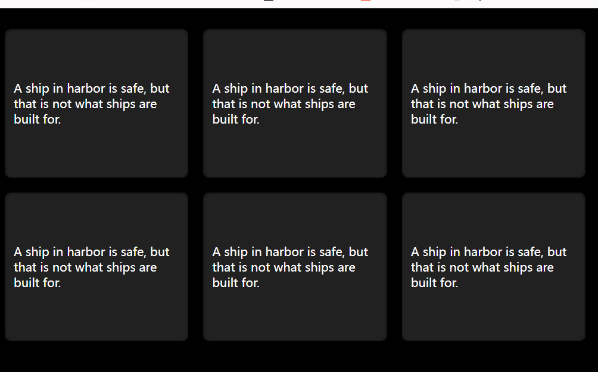

## 效果


## 代码
### html

``` html
<div class="container">
    <div class="card">
        <div class="inner">
            A ship in harbor is safe, but that is not what ships are built for.
        </div>
    </div>
    <div class="card">
        <div class="inner">
            A ship in harbor is safe, but that is not what ships are built for.
        </div>
    </div>
    <div class="card">
        <div class="inner">
            A ship in harbor is safe, but that is not what ships are built for.
        </div>
    </div>
    <div class="card">
        <div class="inner">
            A ship in harbor is safe, but that is not what ships are built for.
        </div>
    </div>
    <div class="card">
        <div class="inner">
            A ship in harbor is safe, but that is not what ships are built for.
        </div>
    </div>
    <div class="card">
        <div class="inner">
            A ship in harbor is safe, but that is not what ships are built for.
        </div>
    </div>
</div>
```
### CSS

``` css
body {
    background: #000;
}
.container {
    display: flex;
    flex-wrap: wrap;
    width: 800px;
    min-height: 400px;
}
.card {
    height: 200px;
    width: calc((100% - 60px) / 3);
    margin-right: 20px;
    margin-top: 20px;
    background: rgba(255, 255, 255, 0.1);
    border-radius: 8px;
    aspect-ratio: 4/3;
    cursor: pointer;
    position: relative;
    color: #fff;
    overflow: hidden;
    --x: 0px;
    --y: 0px
}
.card .inner {
    position: absolute;
    border-radius: inherit;
    inset: 2px;
    background: #222;
    display: flex;
    align-items: center;
    justify-content: center;
    z-index: 3;
    padding: 10px;
}
.card:before {
    content: " ";
    position: absolute;
    border-radius: inherit;
    background: radial-gradient(closest-side circle, rgb(255, 255, 255) 0%, transparent);
    transform: translate(var(--x), var(--y));
    z-index: 2;
    inset: 0;
    left: 0;
    top: 0;
}

```
### JS
``` javascript
    const container = document.querySelector('.container');
    const cards =  document.querySelectorAll('.card');
    container.onmousemove = (e) => {
        for (const card of cards) {
            const rect = card.getBoundingClientRect();
            const x = e.clientX  - rect.left - rect.width/2
            const y = e.clientY  - rect.top - rect.height/2
            card.style.setProperty('--x', `${x}px`)
            card.style.setProperty('--y', `${y}px`)
        }
    }
    container.onmouseout = (e) => {
        for (const card of cards) {
            card.style.setProperty('--x', `0px`)
            card.style.setProperty('--y', `0px`)
        }
    }
```
