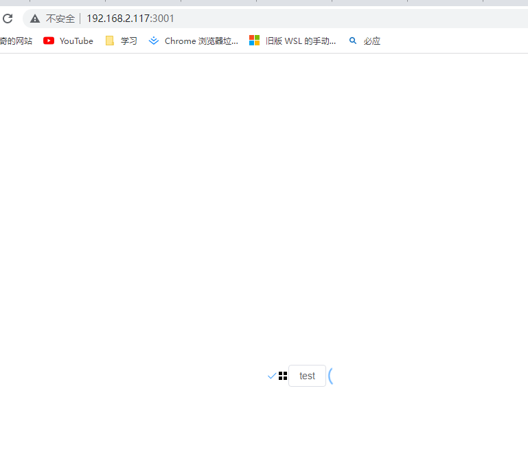

## 本地调试 element-plus 的源码，可以按照以下步骤进行

### element-plus使用 yarn 和 pnpm 管理代码，已安装，直接执行第三步。未安装, 请先安装yarn 和 pnpm

### 1. 安装 yarn

```bash
 npm install -g yarn
 ```

### 2. 安装 pnpm

```bash
npm install -g pnpm
```

### 3. 准备调试

在控制台执行如下步骤

```bash
git clone <https://github.com/element-plus/element-plus.git>
cd element-plus
pnpm install
yarn dev

```

### 4. 浏览器打开已启动的本地服务


