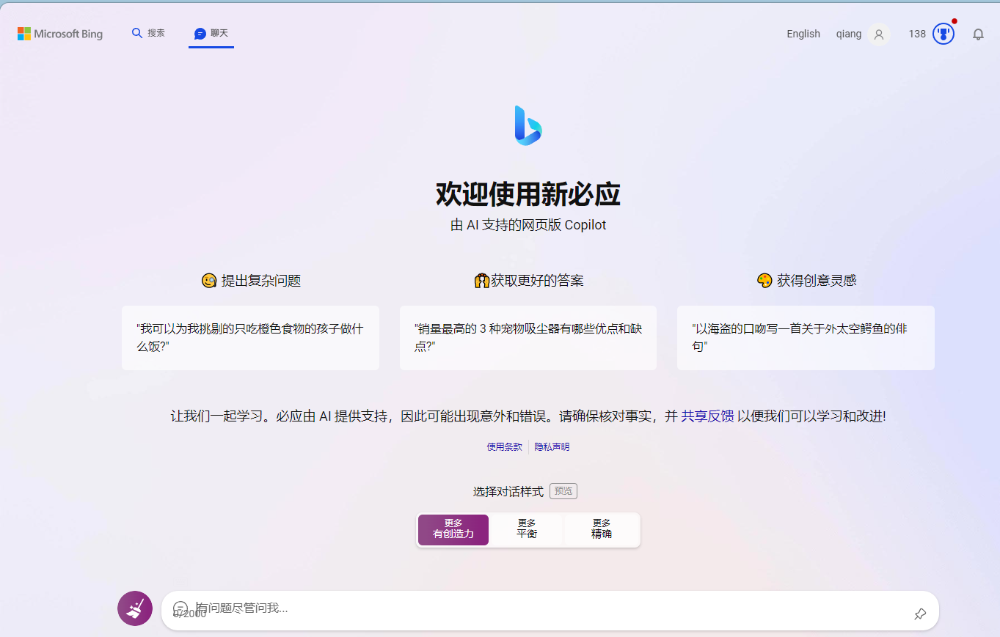

 
### 1 申请新bing候补资格

申请网址：[ https://www.microsoftedgeinsider.com/zh-cn/download/dev ]

> 个人经验：全程挂梯子并且使用谷歌邮箱似乎通过的很快，我本人是一天左右通过的

### 2 使用美区ID 在appStore中下载bing

> 个人经验：bing有3个版本：国际版，中国版，针对中国的个国际版。我们需要的是真正的国际版，所有需要去美区下载

### 3 bing下载成功后，进行以下三步设置

- 手机设置中，地区设置为美国
- 科学上网工具代理地址同样选择到美国
- bing APP中地址也同样选择到美国

### 4 成功使用bing

