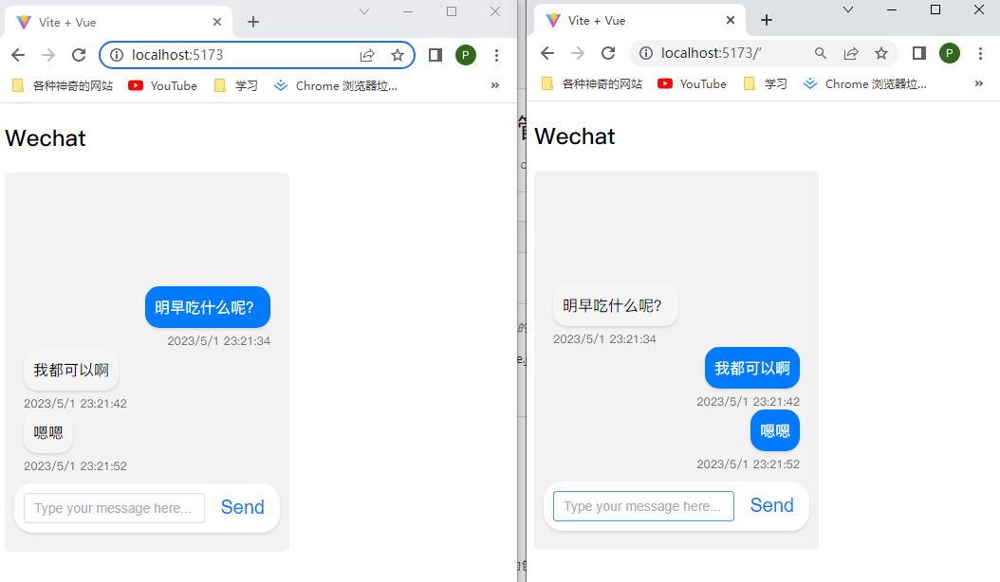

## WebSocket 是什么？
>
> <https://developer.mozilla.org/en-US/docs/Web/API/WebSocket>


  WebSocket 是一种在客户端和服务器之间进行双向通信的协议，它可以实现实时数据传输，具有以下应用场景：

  1. 实时聊天应用程序：使用 WebSocket 可以实现实时聊天应用程序，因为它可以在客户端和服务器之间实时传递消息。

  2. 在线游戏：WebSocket 可以在客户端和服务器之间快速传递游戏数据，从而实现在线游戏。

  3. 实时数据传输应用程序：WebSocket 可以用于实时监控应用程序或传感器，因为它可以在客户端和服务器之间实时传输数据。

  4. 实时协作工具：WebSocket 可以用于协作应用程序，如在线白板或协作文档编辑器。

  5. 实时财经应用程序：WebSocket 可以用于实时股票报价或实时货币汇率转换等实时财经应用程序。

  总之，WebSocket 可以在需要实现实时数据传输或实时通信的任何应用程序中使用。

## 使用vue和NodeJS实现一个简单的demo

### 前端代码（Vue.js）

```js
<template>
    <h2> Wechat </h2>
    <div class="chat-container">
      <div class="message-box">
        <div class="chat-message" v-for="msg in messages" :key="msg.id"
          :class="msg.contentOwer === pageName ? 'outgoing' : 'incoming'">
          <div class="chat-message-content">
            {{ msg.content }}
          </div>
          <div class="chat-message-time">
            {{ msg.timestamp }}
          </div>
        </div>
      </div>
      <div class="chat-input-container">
        <el-input type="text" class="chat-input" placeholder="Type your message here..." v-model="message"
          @keydown.enter="sendMessage" />
        <button class="chat-send-button" @click="sendMessage"> Send </button>
      </div>
    </div>
</template>

<script>
import { io } from 'socket.io-client';
export default {
  data() {
    return {
      socket: null,
      messages: [],
      message: '',
      pageName: ''
    };
  },
  mounted() {
    this.socket = io('ws://localhost:3000');

    this.socket.on('connect', () => {
      console.log('Connected to server');
    });

    this.socket.on('message', (data) => {
      this.messages.push(data);
    });

    this.socket.on('disconnect', () => {
      console.log('Disconnected from server');
    });

    this.pageName = 'my_page_' + Math.random().toString(36).substr(2, 10);

  },
  methods: {
    sendMessage() {
      if (this.message) {
        const messageData = {
          content: this.message,
          timestamp: new Date().toLocaleString(),
          contentOwer: this.pageName
        };
        this.socket.emit('message', messageData);
        this.message = '';
      }
    },
  },
};
</script>
<style>
.chat-container {
  display: flex;
  flex-direction: column;
  justify-content: end;
  min-height: 400px;
  width: 300px;
  background-color: #f2f2f2;
  border-radius: 6px; 
  overflow: hidden;
}

.chat-message {
  display: flex;
  flex-direction: column;
  align-items: flex-start;
  /* margin: 10px; */
}
.message-box{
  overflow-y: auto;
  max-height: 400px;
  padding: 0 20px;
}

.chat-message-content {
  max-width: 70%;
  padding: 10px;
  background-color: #fff;
  border-radius: 15px;
  font-size: 16px;
  line-height: 1.5;
  box-shadow: 0px 2px 3px rgba(0, 0, 0, 0.1);
}

.chat-message-time {
  margin-top: 5px;
  font-size: 12px;
  color: #666;
}

.chat-message.incoming .chat-message-content {
  background-color: #f5f5f5;
}

.chat-message.outgoing {
  align-items: end;
}

.chat-message.outgoing .chat-message-content {
  background-color: #007aff;
  color: #fff;
}

.chat-input-container {
  display: flex;
  align-items: center;
  margin: 10px 10px 20px 10px;
  background-color: #fff;
  border-radius: 20px;
  box-shadow: 0px 2px 3px rgba(0, 0, 0, 0.1);
  overflow: hidden;
}

.chat-input {
  flex: 1;
  border: none;
  padding: 10px;
  font-size: 16px;
  font-family: inherit;
}

.chat-send-button {
  background-color: transparent;
  border: none;
  color: #007aff;
  font-size: 20px;
  margin-right: 10px;
  cursor: pointer;
}

.chat-send-button:hover {
  color: #0052cc;
}
</style>
```

后端代码（NodeJS）

```js
const httpServer = require('http').createServer((req, res) => {
  // 处理 / 路由的 GET 请求
  if (req.method === 'GET' && req.url === '/') {
    res.writeHead(200, { 'Content-Type': 'text/plain' });
    res.end('Hello, service is running');
  } else {
    // 处理其他请求，比如 WebSocket 的连接
    // ...
  }
});
const io = require('socket.io')(httpServer, {
  cors: {
    origin: '*',
  },
});

io.on('connection', (socket) => {
  console.log('New client connected');

  socket.on('message', (data) => {
    console.log(`Received message: ${data.content}`);
    io.emit('message', data);
  });

  socket.on('disconnect', () => {
    console.log('Client disconnected');
  });
});

httpServer.listen(3000, () => {
  console.log('WebSocket server listening on port 3000');
});
```

## 运行结果


